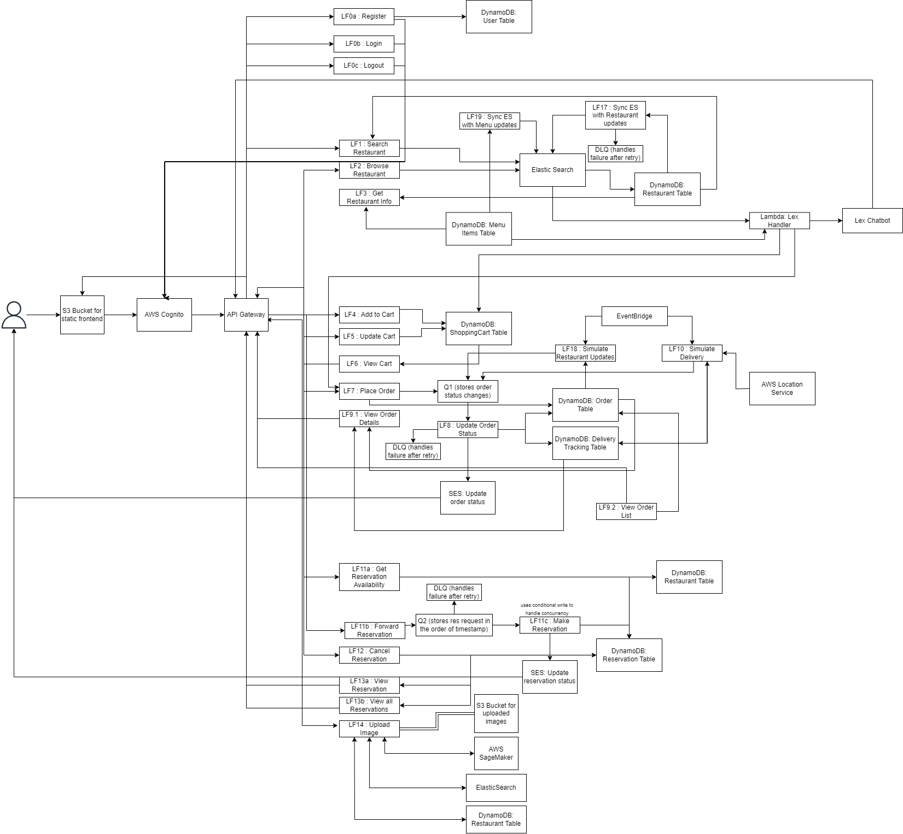

# FeastFleet – Serverless Food Delivery & Reservation App  

FeastFleet is a scalable, serverless web application that enables users to search for restaurants, browse menus, place orders via chatbot, track deliveries in real-time, make reservations perform smart food searches using image recognition. The system is designed for high availability, efficiency, and fault tolerance, leveraging AWS cloud services.

## Features & AWS Services

### Frontend & Authentication  
- A responsive web application providing a seamless user experience.  
- **AWS Services Used:**  
  - **S3** – Hosts the static frontend for high availability and scalability.  
  - **API Gateway** – Enables secure communication between the frontend and backend services.  
  - **Cognito** – Manages user authentication and authorization.  

### Search & Browse Restaurants  
- Enables users to find restaurants based on name, cuisine, or location.  
- **AWS Services Used:**  
  - **OpenSearch** – Facilitates fast, large-scale text-based restaurant search.  
  - **DynamoDB** – Stores structured restaurant data with high availability.  
  - **Lambda** – Synchronizes OpenSearch with DynamoDB in real time.

### Browse Menu & Place Orders  
- Displays restaurant menus and allows users to add items to their cart before placing an order.  
- **AWS Services Used:**  
  - **DynamoDB** – Stores menu data with quick lookup capabilities.  
  - **API Gateway + Lambda** – Fetches menu items and processes cart updates.  

### Place an Order via Chatbot  
- Users can interact with a Lex-powered chatbot to place food orders.  
- **AWS Services Used:**  
  - **Lex** – Natural Language Processing (NLP) chatbot for interactive order placement.  
  - **Lambda** – Handles backend order processing and integration with the database.  

### Process Orders and Track Order Status in Real-Time  
- Users can track their order delivery progress dynamically.  
- **AWS Services Used:**  
  - **AWS Location Service** – Generate the delivery route.
  - **EventBridge** – Simulates real-time updates to the delivery status.
  - **SQS** – Ensures reliable, scalable order placement by queueing requests and processing them asynchronously.
  - **DynamoDB** – Maintain the most up-to-date order status.
  - **SES** – Sends order status updates to customers via email.  

### Check Restaurant Availability & Create Reservations  
- Allows users to check table availability and book reservations.  
- **AWS Services Used:**  
  - **DynamoDB** – Stores reservation records. Uses conditional write to ensure no concurrent bookings.  
  - **SQS** – Queues and processes reservations **in the order they are received** to prevent concurrency issues.  
  - **Lambda** – Manages reservation requests and updates.  
  - **SES** – Sends reservation confirmation emails.  

### Smart-Search with Food Images  
- Users can search for food items using image-based recognition.  
- **AWS Services Used:**  
  - **S3** – Stores uploaded food images.  
  - **SageMaker** – Analyzes images and returns relevant search results.  

## System Design  
Below is the system architecture diagram illustrating the core components and AWS integrations.  

  

## Demo  
Watch the live demo on YouTube: [Demo Link](https://www.youtube.be/ZKgTeo2K9vY)  

